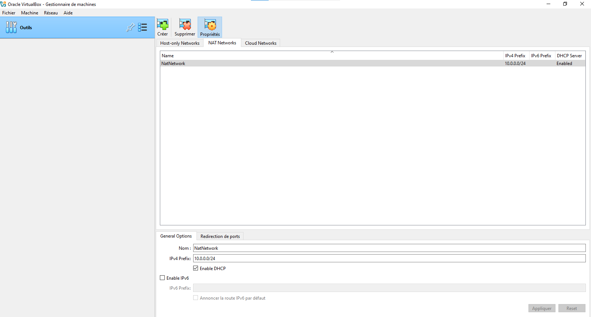
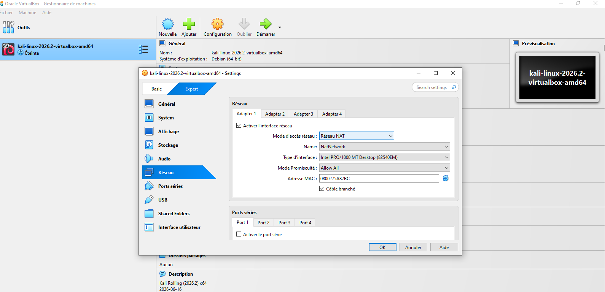
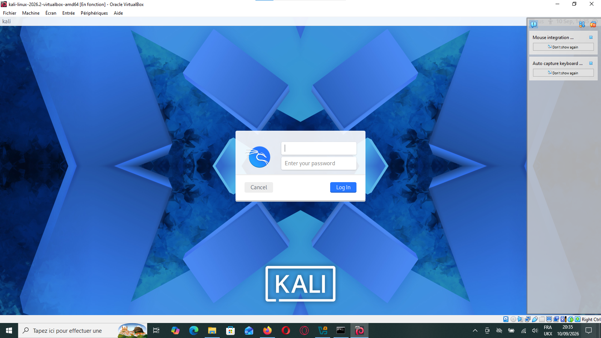
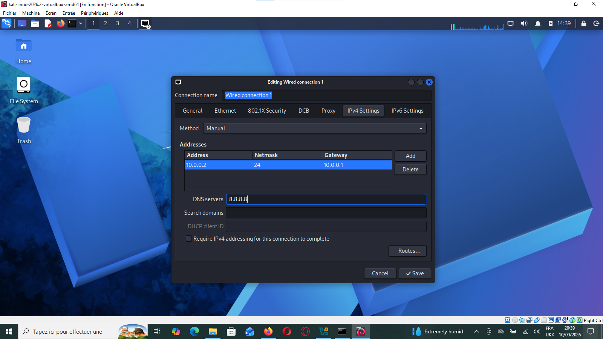
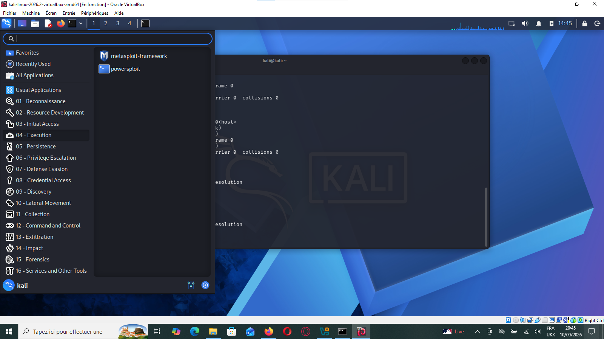
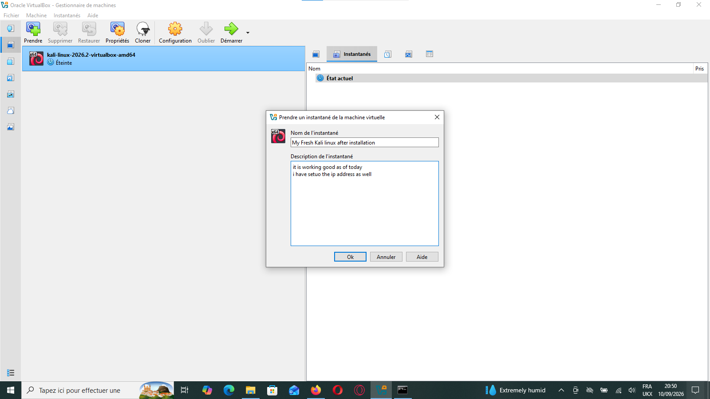

# Kali Linux VirtualBox Lab Setup

A step-by-step guide to installing Kali Linux on VirtualBox, configuring a static NAT Network.

## 🛠️ Configuration Overview

| Parameter          | Value              |
|--------------------|--------------------|
| Host OS            | Windows 10/11      |
| VirtualBox Version | 7.2.16 (amd64)     |
| Guest OS           | Kali Linux 2026.2  |
| Network Type       | VirtualBox NAT Network |
| IPv4 Subnet        | 10.0.0.0/24        |
| Static IP Address  | 10.0.0.2           |
| Netmask            | 24 (255.255.255.0) |
| Gateway            | 10.0.0.1           |
| DNS Server         | 8.8.8.8            |

## 🚀 Setup Steps

### 1. Create the NAT Network

Open VirtualBox → **Tools** → **Network** → **NAT Networks** and create a network named `NatNetwork` with:

- IPv4 Prefix: `10.0.0.0/24`
- DHCP: Enabled

**NAT Networks Manager – NatNetwork (10.0.0.0/24)**

Attach this network to the VM under **Settings → Network → Attached to: NAT Network**.

**VM Settings – Network Adapter attached to NAT Network**

### 2. Log in to Kali

Start the VM and log in with the default Kali credentials.

**Kali Linux Login Screen**

### 3. Manual network configuration inside Kali (GUI)

Open the NetworkManager settings from the top panel, edit **Wired connection 1**, and go to the **IPv4 Settings** tab:

- Method: `Manual`
- Address: `10.0.0.2`
- Netmask: `24`
- Gateway: `10.0.0.1`
- DNS servers: `8.8.8.8`

Click **Save** and reconnect the interface.

**Manual IPv4 Configuration – Wired Connection 1**

### 4. Confirm the setup is working

Once connected, the Kali desktop and application menu (Metasploit, PowerSploit, etc.) should be fully accessible.

**Kali Applications Menu – Execution Tools (Metasploit, PowerSploit)**

### 5. Save your progress with a snapshot

Take a VirtualBox snapshot once the machine is configured and working, so you can always roll back to a clean, functional state.

**Creating a Snapshot – "My Fresh Kali linux after installation"**

## ✅ Result

A fully working Kali Linux VM with:
- A stable NAT Network connection
- A static IP configuration
- A saved snapshot as a safe restore point

## About

Cybersecurity Lab Setup VirtualBox + Kali Linux configuration.
